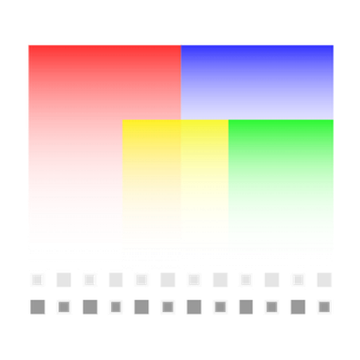
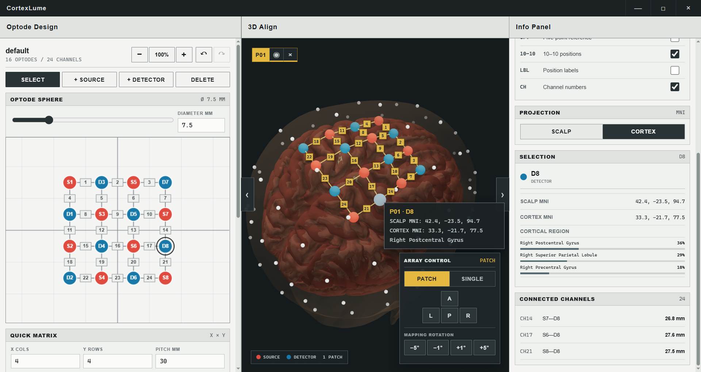
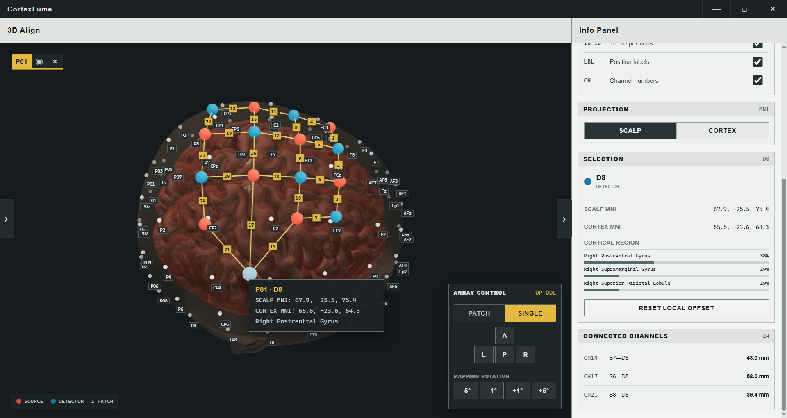
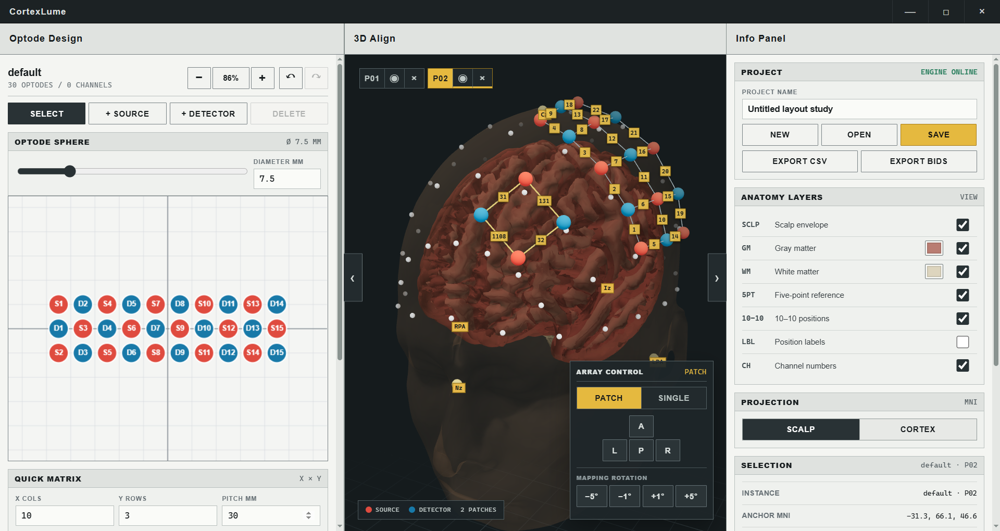
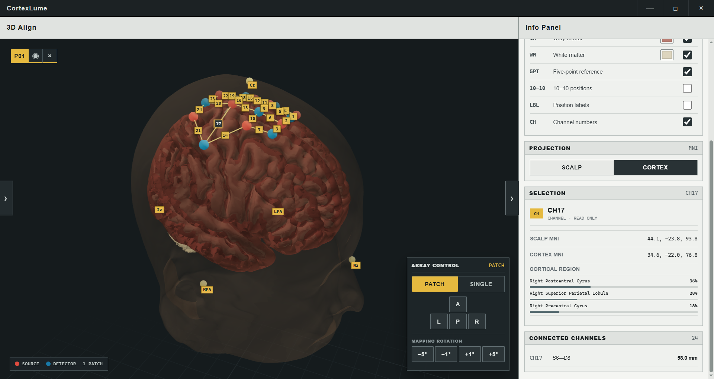

<div align="center">
  
</div>

# CortexLume

CortexLume is an offline Electron workstation for designing fNIRS source-detector layouts, placing reusable layout patches on an anatomical head model, and reporting scalp and cortical coordinates in MNI space.

The application includes a high-density 2D matrix editor, channel solver and numbering table, layered scalp/gray-matter/white-matter rendering, five-point registration landmarks, 10–10 reference positions, reusable patch placement, project persistence, and CSV/BIDS geometry output.

## Features

### 2D Matrix Editor & Array Design
Design and edit high-density fNIRS source-detector arrays with an intuitive matrix interface.



### Single Channel Modification
Precisely modify individual channels and source-detector pairs with real-time feedback.



### Omnidirectional Head Model Visualization
View and interact with your layout on a 3D anatomical head model with multiple viewing angles and cortical surface rendering.



### Project Simulation & Validation
Simulate and validate your fNIRS layout design, verify channel coverage, and check for conflicts.



## Development

Requirements: Node.js 24, pnpm 10, and Python 3.12.

```powershell
pnpm install
py -3.12 -m venv .venv
.\.venv\Scripts\python -m pip install -e "services/science[dev]"
$env:CORTEXLUME_PYTHON = "$PWD\.venv\Scripts\python.exe"
pnpm dev
```

Run checks with `pnpm typecheck`, `pnpm test`, and `pnpm build`.

## Windows distribution

Build the PyInstaller science service, packaged application, Squirrel installer,
and portable ZIP with:

```powershell
pnpm package:win
```

Artifacts are written under `apps/desktop/out/make`. See
`docs/SCIENTIFIC_ASSET_PIPELINE.md` for the reproducible anatomical asset
contract and validation process.

## License

CortexLume source code is released under the permissive [MIT License](LICENSE).
Bundled anatomical templates and other scientific assets retain their upstream
licenses and attribution requirements; see [THIRD_PARTY_NOTICES.md](THIRD_PARTY_NOTICES.md).
