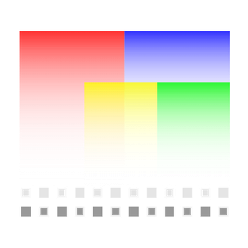
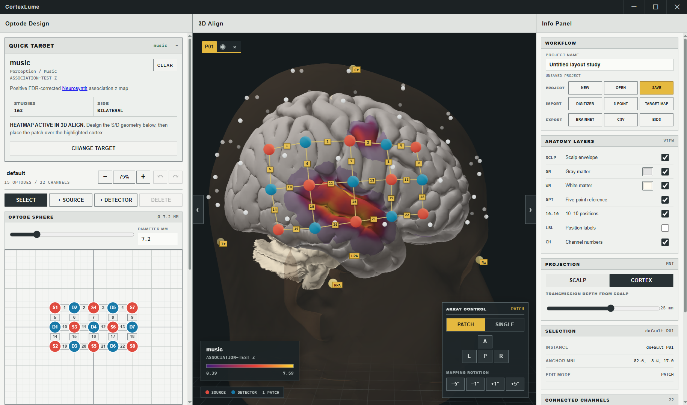
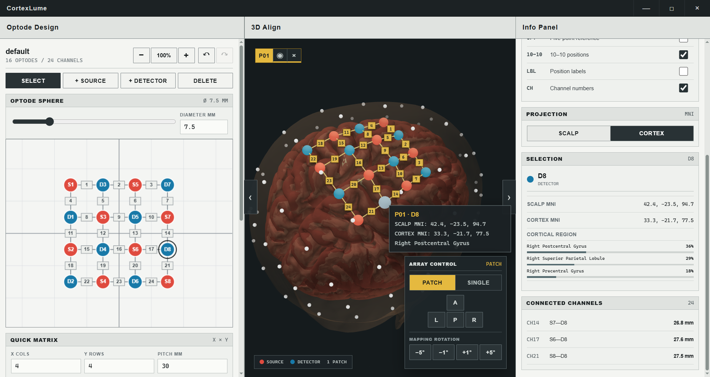
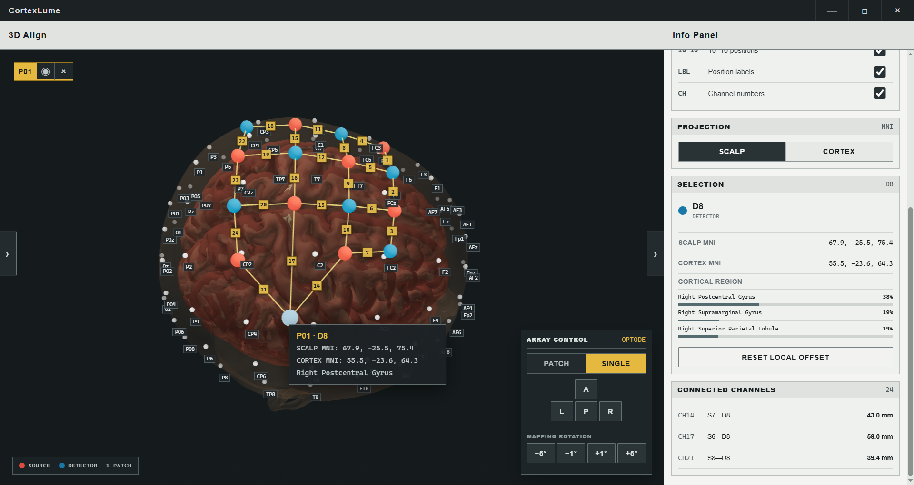
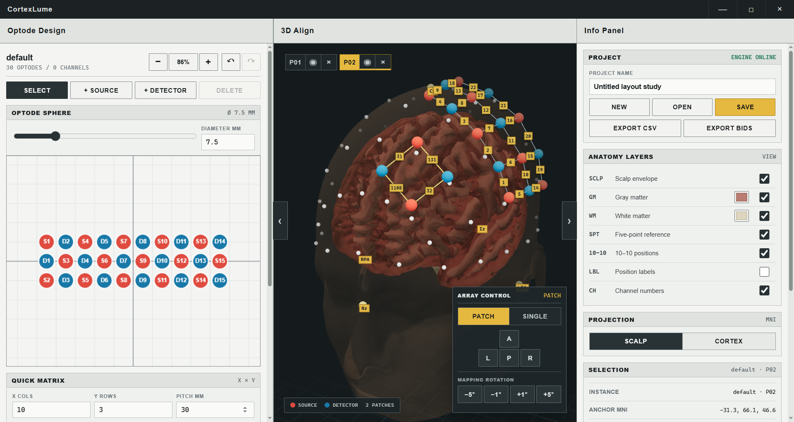
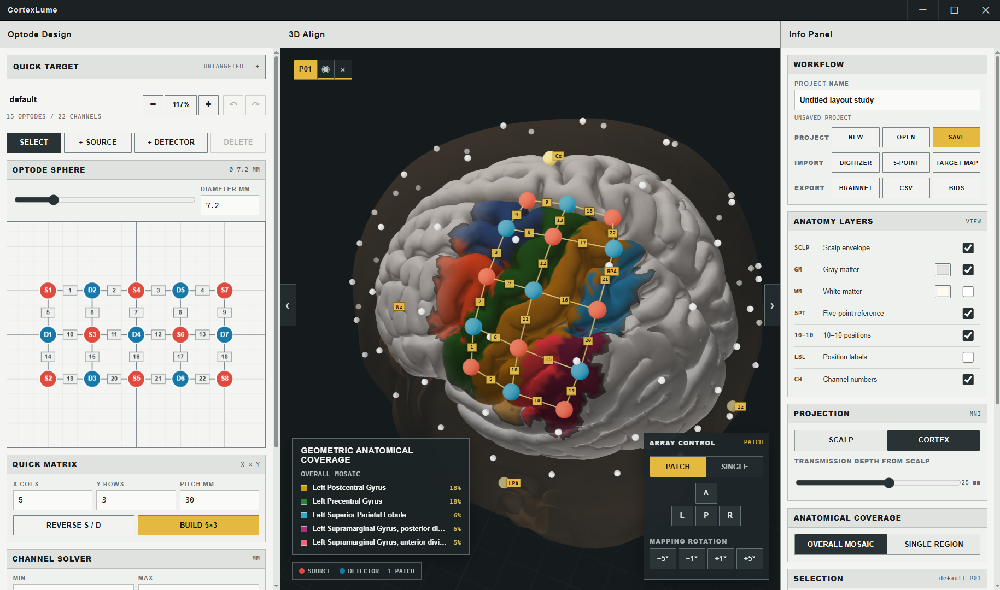
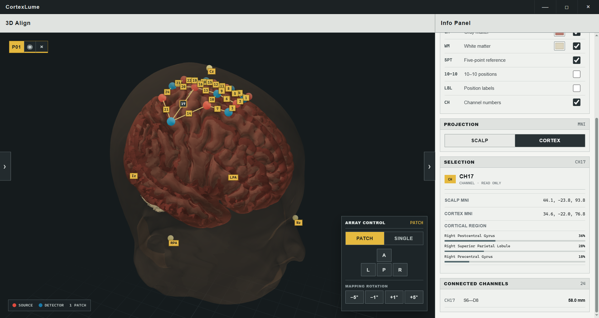

<div align="center">
  
</div>

# CortexLume

[](https://github.com/inewhero/CortexLume/releases/latest)
[](https://deepwiki.com/inewhero/CortexLume)

## How to use

### Install with an AI coding agent

Paste the prompt below into Claude Code, Codex, or another coding agent with local file and MCP configuration access. The agent will install the latest Windows release and connect CortexLume as a local stdio MCP server. It will ask which project folders CortexLume may access before changing the MCP configuration.

```text
Install the latest stable CortexLume release from
https://github.com/inewhero/CortexLume/releases/latest on this Windows machine.

Use the portable x64 package unless an installed application is more appropriate
for this environment. Configure CortexLume as a local stdio MCP server for this
agent using CortexLume.exe --mcp-stdio. Before editing the MCP configuration, ask
me which working folders to authorize, then pass each approved folder as an
--mcp-root=<absolute-path> argument. Do not grant broader filesystem access.

After installation, start a clean MCP session, call get_capabilities, and report
the installed CortexLume version, asset status, authorized roots, and available
planning tools. Do not create a layout project until I provide a target and patch
requirements.
```

To work manually, download either the installer or portable ZIP from the [latest release](https://github.com/inewhero/CortexLume/releases/latest), open CortexLume, and follow the desktop workflow below. Agent-generated `.cortexlume` projects open in the same interface for visual inspection and adjustment.

CortexLume is a scientifically validated, offline Windows workstation for designing fNIRS source–detector layouts, aligning reusable patches on an anatomical head model, and exporting reproducible scalp, display, and cortical coordinates in MNI space.

The application combines literature-derived functional target heatmaps, strict statistical NIfTI import, a high-density 2D array editor, multi-patch 3D alignment, sphere-aware scalp and cortical projection, five-point and 10–10 references, Harvard–Oxford probability-volume lookup, anatomical coverage mosaics, project archives, focused CSV results, BIDS-NIRS geometry sidecars, and direct BrainNet Viewer export.

## Features

### Functional target guidance

Open **Optode Design → Quick Target** before drawing the array. CortexLume maps positive, FDR-corrected Neurosynth association z statistics onto the correspondence-backed Cedalion 25k cortical surface, focuses the 3D view on the strongest target vertex, and leaves layout decisions under direct user control. Compose, NiMARE, SPM, FSL, and NeuroVault statistical maps can be imported as `.nii` or `.nii.gz` volumes through **Info Panel → Workflow → NIfTI Map**. Either source becomes the project's single Functional Map layer, with visibility controlled under Anatomy Layers.



### Optode and channel design

Build dense S/D arrays on a 10 mm editing grid with emphasized 30 mm guides. Generate rectangular layouts, reverse source and detector roles, edit channel numbering, zoom the canvas, and save reusable patch definitions.



### Local optode adjustment

Place multiple independent patches, align them on the scalp, rotate the mapping, and switch to single-optode editing when a local correction is required.



### Anatomical inspection

Inspect the scalp, gray matter, white matter, five-point landmarks, 10–10 positions, optodes, channels, and cortical atlas results in one interactive 3D workspace.



### Array coverage mosaic

Turn on **Anatomical Coverage** after placing one or more patches to see the Harvard–Oxford regions intersected by the complete visible array. **Overall Mosaic** shows the covered regional partition on a single gray-matter mesh; **Single Region** isolates one region for closer inspection. The display uses a geometric channel-path coverage prior with atlas membership, and remains separate from photon fluence or subject-specific sensitivity modelling.



### Reproducible output

Export clear coordinate tables for analysis, a technical JSON provenance record, a BIDS-NIRS geometry package, or a BrainNet Viewer bundle that opens the mapped array in MATLAB.



## Scientific validation

The bundled `MNI152NLin6Asym` asset manifest is verified and the atlas, correspondence, and full science gates pass.

| Validation layer | Result | Recorded evidence |
| --- | --- | --- |
| Cedalion source archive | Passed | Cedalion ICBM152 v26.5.1 archive pinned by SHA-256 |
| Vertex-to-MNI correspondence | Passed | 25,000 official vertices; 95th-percentile residual `0.000689 mm` |
| Template grid correspondence | Passed | TemplateFlow 1 mm target is an exact integer subgrid at Cedalion offset `[5, 6, 76]` |
| Brain-mask agreement | Passed | Dice coefficient `0.953731`, above the declared `0.95` gate |
| Runtime cortical contact | Passed | Unsimplified correspondence-backed 25k mesh used for BVH ray and optode-sphere collision; dense pial mesh is display-only |
| Harvard–Oxford atlas | Passed | FSL authority probability volumes mapped losslessly to the locked TemplateFlow RAS+ grid and checked against golden coordinates |
| Functional target mapping | Passed | FDR-supported Neurosynth maps and validated NIfTI statistics mapped to the official Cedalion 25k vertex order with source hashes and mapping QC |
| Anatomical coverage mosaic | Passed | Geometric channel paths mapped once to the Cedalion 25k surface, combined deterministically, and partitioned by original Harvard–Oxford membership on a single GM render path |
| Asset integrity | Passed | Every released template, mesh, atlas index, correspondence table, and QC report is SHA-256 checked at runtime |

Coordinates use `MNI152NLin6Asym`, RAS+, millimetres. Scalp coordinates describe physical optode sphere centres on the head. Display coordinates describe collision-safe sphere centres used internally by the CortexLume cortical renderer, preventing finite-sized nodes from entering deep sulci; they are intermediate, mesh-specific visualization coordinates. Cortical coordinates describe the first correspondence-backed gray-matter contact and remain the portable input to atlas lookup and BrainNet Viewer. Channel atlas results aggregate the sampled geometric channel path; optode atlas results are retained as single-ray references.

Harvard–Oxford percentages are the original population-atlas voxel probabilities, reported as the three highest values without renormalization. CortexLume provides validated template-space planning and reporting with verified correspondence across the bundled template, cortical mesh, and atlas. Studies that collect individual anatomy can extend this workflow with participant-specific registration.

Quick Target values are meta-analytic association z statistics, not activation probabilities. The bundled curated catalog provides 132 usable targets across eight fNIRS planning domains and is built from the pinned Neurosynth 0.7 database with NiMARE, TF-IDF `> 0.001`, MKDAChi2, and independent FDR correction at `p ≤ .05`; only positive vertices inside the corrected support are shown. Its versioned profile supplies stable domains, subdomains, and search aliases, while every displayed target retains its own real nonempty corrected map. Imported NIfTI maps must be a single continuous 3D volume on either the exact CortexLume `MNI152NLin6Asym` 1 mm grid or the locked FSL/legacy Neurosynth MNI152 2 mm grid. CortexLume validates dimensions, affine, qform/sform agreement, units, datatype, finite values, and map class before mapping through Cedalion's official voxel-to-vertex correspondence.

The complete anatomical correspondence evidence is stored in [`cedalion-correspondence-qc.json`](./assets/templates/MNI152NLin6Asym/generated/cedalion-correspondence-qc.json), with the reproducible process documented in [`SCIENTIFIC_ASSET_PIPELINE.md`](./docs/SCIENTIFIC_ASSET_PIPELINE.md). Quick Target generation and release checks are documented in [`quick-target-data.md`](./docs/quick-target-data.md) and the [`curated v1 QC report`](./docs/quick-target-qc-v1.md).

## Desktop workflow

1. **Choose a target.** Expand **Optode Design → Quick Target** to load a Neurosynth heatmap in **3D Align**. For a Compose or analysis-workflow map, choose **Info Panel → Workflow → NIfTI Map**, declare its template, and import the `.nii` or `.nii.gz` file after validation. The most recently loaded source replaces the previous Functional Map; its visibility is controlled in **Anatomy Layers**.
2. **Design a patch.** Create an S/D pattern under the target guide, or generate an `x × y` grid. Adjust optode positions and channel numbering directly on the canvas. Changing or clearing a target never modifies the layout.
3. **Place it on the head.** Drag the layout into **3D Align** and position it over the highlighted cortex. Add further patches for bilateral or distributed coverage.
4. **Align the mapping.** Select one patch, move it over the scalp, and use the rotation controls. Enable single-optode editing only for local corrections.
5. **Choose the display mode.** **Scalp** keeps optodes on the head surface. **Cortex** places each finite-sized optode at its collision-safe cortical display position while retaining the underlying gray-matter contact for analysis. The default channel transmission depth is 25 mm and can be adjusted in **Info Panel**.
6. **Inspect results.** Select an optode or channel to view scalp and cortical MNI together with the highest-probability cortical region. The Info Panel reports the full top-three atlas result. Display MNI remains an export-only visualization coordinate.
7. **Inspect array coverage.** Enable **Anatomical Coverage** to view the overall Harvard–Oxford mosaic for every visible patch, then switch to **Single Region** when checking one anatomical target.
8. **Describe the recording.** Expand **Device** when preparing BIDS output and enter the subject, task, acquisition, run, sampling frequency, and instrument metadata.
9. **Save or export.** Save the editable workspace as `.cortexlume`, or select CSV, BIDS, or BrainNet Viewer output.

## Agent planning through MCP

CortexLume also provides a local machine interface for AI agents. The agent plans and writes a complete `.cortexlume` project; the desktop application remains a focused human workspace for visual review and fine adjustment. No chat surface or provider-specific integration is added to the GUI.

Start the installed application as a stdio MCP server and grant one or more working roots explicitly:

```powershell
& "C:\Path\To\CortexLume.exe" --mcp-stdio --mcp-root="D:\fnirs-projects"
```

An MCP client configuration uses the executable as `command` and passes `--mcp-stdio` plus one or more `--mcp-root=...` arguments. `CORTEXLUME_MCP_ROOTS` may provide additional roots separated by the Windows path delimiter. The MCP process is local and offline: it creates no window, exposes no network API, performs no update check, and writes protocol messages only to stdout. Its token-authenticated loopback science worker is private to the process.

The interface exposes `get_capabilities`, `list_targets`, `search_targets`, `list_atlas_regions`, `plan_project`, `save_project`, `inspect_project`, and `open_project`. Agents first read the complete compact `list_targets` catalog, then use `search_targets` only to narrow its known vocabulary. Planning accepts Quick Target IDs, exact Harvard–Oxford cortical regions, RAS+ MNI points, or authorized local NIfTI files. It uses the same locked scalp and Cedalion 25k meshes, BVHs, sphere collision, projection, channel kernel, atlas assets, and QC rules as the GUI. Missing or altered planning assets stop the request; no ellipsoid fallback is used.

`plan_project` returns three spatially distinct deterministic candidates with target-mass coverage, off-target specificity, perturbation robustness, Harvard–Oxford anatomical alignment, optode clearance, and spacing-distortion metrics. Every nominal placement must remain on the cranial scalp supported by the locked cortical surface; ear, face, and neck placements are rejected before ranking. Functional coverage and specificity remain the primary ranking signals, while atlas alignment refines otherwise comparable candidates. The response also reports whether the target is spatially distributed and recommends a patch count when one array cannot represent its major surface components. `save_project` writes the selected candidate as a new format-v2 archive and never overwrites an existing path. When planning from an existing project, the result records the source project hash and is always saved as a derived file. `open_project` launches a separate CortexLume desktop process so another window's unsaved work remains untouched.

Format-v2 `.cortexlume` archives retain the sparse Functional Target map, active surface overlay, and complete Agent planning provenance in the hash-verified `project.json + manifest.json` archive. NIfTI projects store the mapped Cedalion 25k values, original filename, and SHA-256 rather than embedding the source volume. CortexLume migrates valid v1 archives in memory when opening them. The v2 version marker also makes older readers reject the archive instead of silently dropping its target and planning data; future unsupported versions are rejected explicitly.

## Data integrity and exports

### CSV

CSV export creates `cortexlume_optodes.csv` and `cortexlume_channels.csv`. These tables contain calculated coordinates, distances, channel definitions, and Harvard–Oxford atlas results only. QC decisions and internal flags are deliberately excluded from CSV.

`cortexlume_export.json` is the authoritative technical companion. It records the template and atlas hashes, projection settings, device metadata, complete layouts and instances, projection results, channel-level spacing errors, declared QC thresholds, flags, and export warnings. Export format version 3 separates readable results from machine-auditable provenance.

### BIDS-NIRS

BIDS export creates subject/session NIRS geometry files, coordinate-system metadata, device information, and one channel row per source–detector–wavelength combination. Add the matching SNIRF recording to complete the BIDS-NIRS dataset. CortexLume's full technical JSON is retained under `sourcedata`.

### BrainNet Viewer

**Export BrainNet** writes:

- the standard CortexLume optode and channel CSV files;
- `cortexlume_brainnet.node`;
- `cortexlume_open_brainnet.m`;
- the technical JSON and a short format note.

The MATLAB script loads the validated node file, locates `BrainNet_MapCfg`, selects BrainNet Viewer's ICBM152 surface, and opens the result with source optodes in red and detectors in blue. `cortexlume_brainnet.node` passes cortical MNI x/y/z (R/A/S) millimetres to BrainNet unchanged. Display MNI remains available in CSV and JSON as a mesh-specific CortexLume visualization coordinate and is not transferred to BrainNet's distinct surface mesh. Labels remain available but are hidden by default. The script saves left, right, anterior, posterior, dorsal, two lateral-oblique and one posterior-dorsal view, plus an array-facing optimized view. It arranges these into an fNIRS-oriented 3×3 mosaic without colorbars or a ventral view, then leaves the interactive viewer on the optimized view. CortexLume does not generate BrainNet edges.

Automatic launch requires MATLAB and BrainNet Viewer on the MATLAB search path. `CORTEXLUME_MATLAB` can point to a specific `matlab.exe`. The integration is tested against MATLAB R2020a and the 2019 BrainNet Viewer distribution (`BrainNet.m` 1.63 and `BrainNet_MapCfg.m` 1.52). BrainNet Viewer remains an external application and is not bundled with CortexLume. See the [official BrainNet Viewer project](https://www.nitrc.org/projects/bnv/) and cite [Xia, Wang, and He (2013)](https://doi.org/10.1371/journal.pone.0068910) when publishing its figures.

## Development

Requirements: Node.js 24, pnpm 10, and Python 3.12.

```powershell
pnpm install
py -3.12 -m venv .venv
.\.venv\Scripts\python -m pip install -e "services/science[dev]"
$env:CORTEXLUME_PYTHON = "$PWD\.venv\Scripts\python.exe"
pnpm dev
```

Run checks with `pnpm typecheck`, `pnpm test`, and `pnpm build`. After packaging, `pnpm smoke:packaged:mcp` verifies the real EXE's protocol-only stdout, MCP handshake, Quick Target planning, v2 archive round-trip, and project-file GUI launch.

## Windows distribution

Build the PyInstaller science service, packaged application, Squirrel installer, and portable ZIP with:

```powershell
pnpm package:win
```

Artifacts are written under `apps/desktop/out/make`. Release builds package the checksum-pinned anatomical and atlas assets but do not include source archives, temporary processing environments, or external applications such as MATLAB and BrainNet Viewer. Packaged builds check for stable application updates silently while online; an available version appears in the title bar and opens the latest GitHub release when selected.

## License

CortexLume source code is released under the permissive [MIT License](LICENSE). Bundled anatomical templates and atlas assets retain their upstream licenses and attribution requirements; see [THIRD_PARTY_NOTICES.md](THIRD_PARTY_NOTICES.md).
